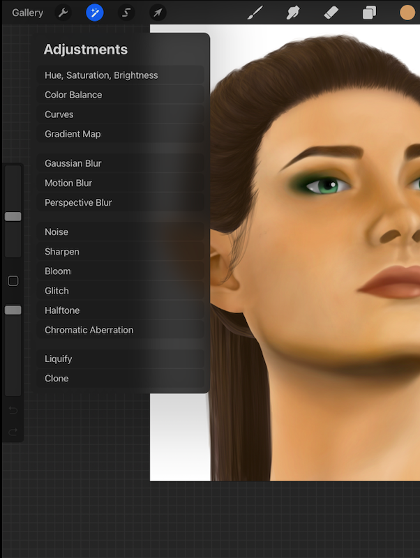
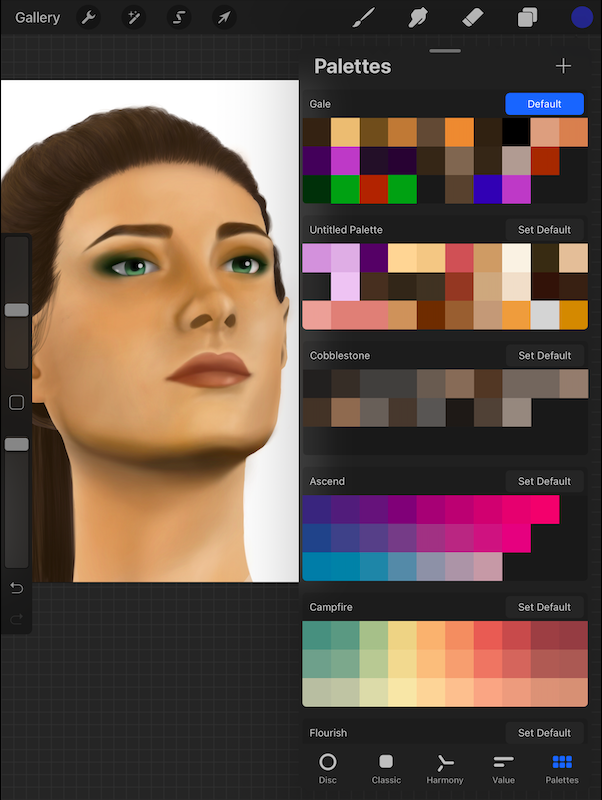
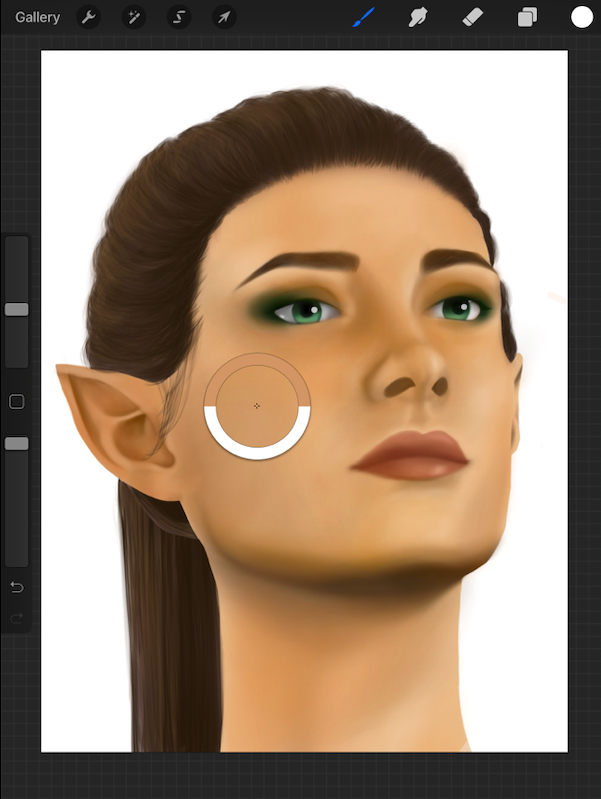

# Kailey's UX Class Experience

## UX Journal

### Journal #2: Making Art Using Procreate
#### Kailey Stauble, April 30, 2021

  Procreate is a popular app that is used by artists to create digital artwork due to its versatility, features, and abilities. I have been using Procreate for a few years now and I beleive the app is well made in terms of usability. 
  When I use Procreate, my goal is to be able to create something, usually a digital painting. In order for this app to be an upgrade for artists, it is important that it provides the simplicity of drawing or painting with a pencil or paintbrushes rather than adding too many features that take away from the main goal of creating art. Procreate does this well with a very simple layout tht provides the basics such as a color wheel, a dropdown menu for different brushes, the current layer, and two sliders to control brush width and opacity. The layout allows the focus to remain on the artwork rather than the features of the app, although those are not lacking either. Upon tapping one of the simple icons, users are able to refine details to their preferences such as changing the spacing, jitter, and fall off of a brush stroke and creating palettes to suit their needs and make reusing colors easier. Users can also drag and drop colors onto the page to fill large enclosed areas, speeding up the process of filling in base colors. 
  Whenever I interact with Procreate as a user, I almost always discover new ways to use the app. This is a good thing and a bad thing; the features that I have found are very useful but there is a lack of instructions on how to utilize the app to its full potential. Due to the lack of labeling on some of the options in drop down menus, Procreate has some issues with **learnability** as the user is often unsure of what some of the buttons do and therefore must teach themselves how to use the app. This can make it difficult especially for first time users as it can be daunting to try and learn all of the features that are hidden in the menus. 
  Outside of the issue of learnability, Procreate certainly does well in meeting other usability goals. As a user, the app is very **satisfying** to use. The layout is simple enough and the quick actions that users can take are easy and streamline artwork. For example, using two fingers to tap the screen immediately undoes a brush stroke and three fingers to tap the screen redoes a brush stroke. These actions give immediate feedback to the user and makes the experience of using the app much more enjoyable. 
  The outcome of using this app is a streamlined, fun to use application that allows users to be infinitely creative using the features it provides. Although the app could benefit from a help section or a guide to its many features, overall it is very user friendly and provides a satisfying interaction for any user. 
  
First Picture: The Adjustments menu which has a variety of options but may be hard to know what each one does if the user is new. 

Second Picture: The Palettes menu which allows users to use pre-made palettes or create their own.

Third Picture: The Color Match feature which allows users to hold down on a color anywhere on the drawing and change the brush color to that color.

